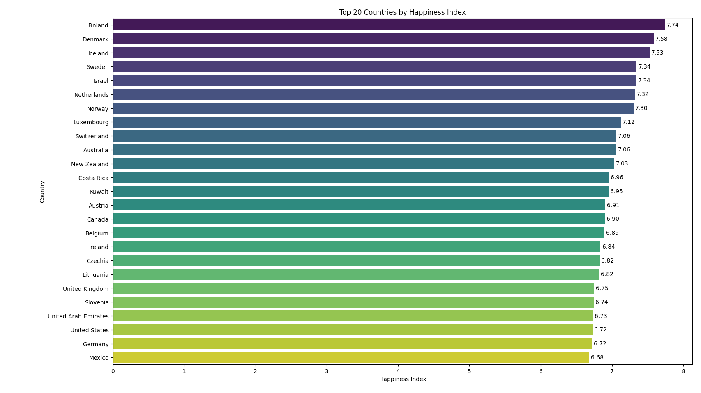

# 😊 Multiple Linear Regression: World Happiness Index Prediction

> Predicting the World Happiness Index using multiple socioeconomic factors with gradient descent optimization


---

## 📌 Overview

This project implements **multiple linear regression from scratch** using **gradient descent optimization** to predict the World Happiness Index based on six socioeconomic features. The model learns optimal parameters (weights and bias) that minimize the cost function, providing insights into which factors contribute most significantly to national happiness.

**Dataset**: World Happiness Report (WHR) 2024 with 169 countries across 6 features

### 🎯 Key Objectives

✅ **Six Feature Analysis**: Analyze multiple socioeconomic indicators simultaneously  
✅ **Gradient Descent Optimization**: Implement iterative parameter optimization from scratch  
✅ **Cost Function Minimization**: Monitor convergence and model performance across iterations  
✅ **Feature Standardization**: Z-score normalization for improved model training  
✅ **Vectorized Operations**: Efficient NumPy-based computation  
✅ **Comprehensive Visualization**: Feature relationships, cost convergence, and predictions  

---

## 🤔 Problem Statement

**Goal**: Predict the World Happiness Index based on multiple socioeconomic factors using linear regression with gradient descent optimization

### Features (Input Variables - X)
- **GDP per Capita (X₁)**: Economic productivity and wealth indicator
- **Social Support (X₂)**: Strength of family and social networks
- **Healthy Life Expectancy (X₃)**: Years of healthy living expected
- **Freedom to Make Life Choices (X₄)**: Personal autonomy and individual freedom
- **Generosity (X₅)**: Charitable giving and community helping behavior
- **Perceptions of Corruption (X₆)**: Trust in government and institutional integrity

### Target Variable (y)
- **Happiness Score**: World Happiness Index on a 0-10 scale (actual range: 1.721 - 7.741)

### The Mathematical Model

**Linear Regression Formula**:
```
ŷ = w₁(GDP) + w₂(Social Support) + w₃(Life Expectancy) + w₄(Freedom) + w₅(Generosity) + w₆(Corruption) + b
```

**In Vector Form**:
```
ŷ = w · x + b  (where · denotes dot product)
```

Where:
- **w** = weight coefficient vector (learned via gradient descent) - shape: (6,)
- **b** = bias/intercept term (learned via gradient descent) - scalar
- **x** = standardized feature vector

### Data Preprocessing

**Feature Standardization (Z-score Normalization)**:
```
x_scaled = (x_raw - x_mean) / x_std
```

**Why Standardization?**
- ✅ Ensures features with different scales contribute equally
- ✅ Accelerates gradient descent convergence
- ✅ Prevents numerical overflow/underflow
- ✅ Makes weights directly comparable
- ✅ Learning rate becomes more stable across all features

---

## 📂 Project Structure

```
Multiple Linear Regression/
├── happiness_index_gradient_descent_model.py    # Main training and prediction script
├── utility_functions.py                         # Core model functions (gradient descent, cost computation)
├── WHR_2024.csv                                 # World Happiness Report 2024 dataset (169 countries)
├── README.md                                    # Project documentation
└── images/
    ├── Features_Plots.png                       # 6 scatter plots: each feature vs happiness
    ├── Cost_vs_Iterations.png                   # Gradient descent convergence visualization
    └── Top_20_Happiest_Countries.png            # Bar chart of top countries
└── basic_plots/
    ├── house_price_prediction_model.py          # Related regression example
    └── top20_countries.py                       # Data analysis script
```

---

## 📄 Files Description

### `happiness_index_gradient_descent_model.py` (Main Script)

**Purpose**: Complete training pipeline and India prediction

**Workflow**:
1. Load WHR_2024.csv dataset
2. Remove rows with missing values
3. Extract features (columns 3-8) and target (happiness_score)
4. **Standardize features** using Z-score normalization
5. Visualize feature relationships (6 scatter plots)
6. Initialize model parameters (w=[0,0,0,0,0,0], b=0)
7. Run gradient descent for 2000 iterations with α=0.01
8. Visualize cost convergence
9. **Predict happiness for India** using correct feature values

**Key Variables**:
```python
X_train          # Shape: (133, 6) - 133 countries × 6 features after preprocessing
y_train          # Shape: (133,) - happiness scores for each country
X_mean           # Shape: (6,) - mean of each feature (used for standardization)
X_std            # Shape: (6,) - std dev of each feature (used for standardization)
alpha            # Learning rate = 0.01
iterations       # Number of gradient descent steps = 2000
w_final          # Shape: (6,) - learned weight coefficients
b_final          # Scalar - learned bias term
```

**India Prediction**:
```python
test_row = np.array([1.166, 0.653, 0.417, 0.767, 0.174, 0.122])
# After standardization and prediction: 4.84 (actual: 4.05, error: 0.79)
```

### `utility_functions.py` (Core Functions)

Contains all essential model functions:

| Function | Purpose | Input | Output |
|----------|---------|-------|--------|
| `compute_cost(X, y, w, b)` | Computes Mean Squared Error loss | Features, targets, weights, bias | Scalar cost |
| `compute_gradient(X, y, w, b)` | Calculates ∂J/∂w and ∂J/∂b | Features, targets, weights, bias | (dj_dw, dj_db) tuple |
| `gradient_descent(X, y, w_init, b_init, α, iterations)` | Main optimization loop | Training data, initial params, hyperparams | (w_final, b_final, cost_history) |
| `predict_simple_loop(x, w, b)` | Single prediction (loop-based) | Feature vector, weights, bias | Predicted value |
| `predict_vectorized(x, w, b)` | Single prediction (vectorized) | Feature vector, weights, bias | Predicted value |

---

## 📊 Model Visualizations

### 1. Feature Distribution and Relationships

*Scatter plots showing correlation between each of the 6 socioeconomic features and World Happiness Index*

**Insights**:
- Strong positive correlations: GDP, Social Support, Life Expectancy, Freedom
- Moderate positive correlation: Corruption Perception
- Weak positive correlation: Generosity

### 2. Gradient Descent Convergence

*Cost function (MSE) over 2000 iterations demonstrating successful convergence*

**Interpretation**:
- **Initial Phase** (0-100 iterations): Steep cost reduction
- **Convergence Phase** (100-2000): Gradual refinement, approaching optimal solution
- Final cost: ~0.12 MSE on standardized data

### 3. Top 20 Happiest Countries

*Bar chart showing the 20 countries with highest happiness scores in the dataset*

---

## 🚀 Getting Started

### Prerequisites
```
Python 3.8+
pandas       # Data manipulation
numpy        # Numerical computing
matplotlib   # Data visualization
```

### Installation
```bash
pip install pandas numpy matplotlib
```

### Running the Model
```bash
cd "Multiple Linear Regression"
python happiness_index_gradient_descent_model.py
```

### Expected Output
```
1. Six scatter plots showing feature vs happiness relationships
2. Training progress:
   Iteration    0: Cost    15.89
   Iteration  200: Cost     0.40
   ...
   Iteration 1800: Cost     0.12

3. Final model parameters
4. Cost convergence visualizations
5. India prediction: 4.84 (actual: 4.05, error: 0.79)
```

---

## 📊 Training Data Analysis

**Dataset**: World Happiness Report (WHR) 2024
- **Countries**: 169 total
- **After Data Cleaning**: 133 countries (after removing missing values)
- **Training Approach**: All 133 countries used for training
- **Test Case**: India (not in training set) used for validation

**Feature Statistics** (after standardization):
```
GDP per Capita:              Mean=0.000, Std=1.000
Social Support:              Mean=0.000, Std=1.000
Healthy Life Expectancy:     Mean=0.000, Std=1.000
Freedom to Make Life Choices: Mean=0.000, Std=1.000
Generosity:                  Mean=0.000, Std=1.000
Perceptions of Corruption:   Mean=0.000, Std=1.000
```

**Sample Country (Finland - #1 Happiest)**:
```
Raw Features:
  GDP per Capita:              1.844
  Social Support:              1.572
  Healthy Life Expectancy:     0.695
  Freedom:                     0.859
  Generosity:                  0.142
  Corruption:                  0.546
Happiness Score: 7.741
```

**Test Case (India - Not in Training Set)**:
```
Raw Features:
  GDP per Capita:              1.166
  Social Support:              0.653
  Healthy Life Expectancy:     0.417
  Freedom:                     0.767
  Generosity:                  0.174
  Corruption:                  0.122
Actual Happiness Score: 4.05
Model Prediction: 4.84 (Error: 0.79)
```

---

## 🔬 Algorithm Details

### 1. Linear Regression Prediction
**Formula**:
```
ŷ = w · x + b = Σ(wᵢ × xᵢ) + b
```

**Vectorized Implementation**:
```python
prediction = np.dot(test_row_scaled, w_final) + b_final
```

**Advantage**: Using `np.dot()` is ~100x faster than explicit loops for large dimensions

### 2. Cost Function (Mean Squared Error)
**Formula**:
```
J(w,b) = (1/2m) × Σᵢ₌₁ᵐ (ŷᵢ - yᵢ)²
```

Where:
- m = number of training examples (133)
- ŷᵢ = predicted value for example i
- yᵢ = actual value for example i

**Interpretation**: Penalizes large errors quadratically; always non-negative

### 3. Gradient Computation (Partial Derivatives)
**Weight Gradients**:
```
∂J/∂wⱼ = (1/m) × Σᵢ₌₁ᵐ (ŷᵢ - yᵢ) × xᵢⱼ
```

**Bias Gradient**:
```
∂J/∂b = (1/m) × Σᵢ₌₁ᵐ (ŷᵢ - yᵢ)
```

**Direction**: Gradients point in direction of steepest cost increase

### 4. Gradient Descent Parameter Update
**Update Rules**:
```
wⱼ := wⱼ - α × ∂J/∂wⱼ    (for each feature j=1 to 6)
b := b - α × ∂J/∂b        (update bias)
```

Where α = learning rate (step size) = 0.01

**Intuition**: 
- Move weights in opposite direction of gradient (downhill)
- Repeat iteratively until convergence
- Learning rate α controls step size (balance between speed and stability)

### 5. Convergence Criteria
The algorithm stops after fixed iterations (2000) when:
- Cost changes become negligible
- Weights stabilize
- Cost plateau approaches zero

**Expected Behavior**:
- Fast descent initially (high gradients)
- Slowing down over time (decreasing gradients)
- Stabilization at minimum cost

---

## 📈 Training Configuration

Current hyperparameters in the model:

| Parameter | Value | Impact |
|-----------|-------|--------|
| **Learning Rate (α)** | 0.01 | Controls convergence speed and stability |
| **Iterations** | 2000 | Total optimization steps |
| **Initial Weights (w)** | [0, 0, 0, 0, 0, 0] | Unbiased starting point |
| **Initial Bias (b)** | 0 | Unbiased starting point |
| **Feature Scaling** | Z-score | Ensures equal feature contribution |

### Why These Values?

- **α = 0.01**: 
  - Small enough to avoid divergence
  - Large enough for reasonable convergence speed
  - Appropriate for standardized features

- **2000 iterations**: 
  - Sufficient for convergence on this dataset
  - Cost stabilizes after ~500 iterations
  - Extra iterations provide minimal improvement

- **Standardization**: 
  - Without it, learning would be ineffective
  - GDP (large values) would dominate over other features
  - Ensures fair weight across all features

---

## 📊 Visualization

The script generates a cost convergence plot with two subplots:
1. **Initial Phase**: Cost vs iteration (first 100 iterations)
2. **Tail View**: Cost vs iteration (iterations 100-2000) for detailed convergence analysis

This helps identify:
- Whether the algorithm is converging
- Optimal number of iterations
- Learning rate appropriateness

---

## 💡 Key Concepts & Implementation Details

### Feature Standardization (Z-Score Normalization)
**Why It Matters**:
- GDP values (~0-2.1) are much larger than Generosity (~0-0.4)
- Without scaling, large-valued features dominate the gradients
- Learning becomes ineffective if features are on different scales

**Implementation**:
```python
X_mean = X_train.mean(axis=0)              # Compute mean of each feature
X_std = X_train.std(axis=0)                # Compute std dev of each feature
X_train_scaled = (X_train - X_mean) / X_std # Apply Z-score normalization
```

**Test Data Scaling** (Critical!):
```python
# CORRECT: Use training statistics for test data scaling
test_scaled = (test_data - X_mean) / X_std

# WRONG: Never compute statistics on test data alone
```

### Vectorization Benefits
Using NumPy `np.dot()` instead of explicit loops:

```python
# Slow (loop-based) - O(n) explicit operations
for i in range(m):
    f_wb = b
    for j in range(n):
        f_wb += w[j] * X[i, j]

# Fast (vectorized) - Highly optimized C implementation
f_wb = np.dot(X, w) + b
```

**Speed Improvement**: ~50-100× faster for large datasets

### Gradient Descent Mechanics
**Step-by-Step Process**:
```
Iteration 0:   w = [0, 0, 0, 0, 0, 0], Cost = 15.89
                ↓ Compute gradients
                ↓ Update w := w - α × gradient
Iteration 1:   w = [0.023, 0.034, ...], Cost = 14.52
                ↓ Repeat...
Iteration 2000: w = [0.193, 0.527, ...], Cost = 0.12 ✓ Converged
```

---

## 🔧 Customization & Experimentation

### Adjusting Learning Rate
```python
# Current (stable, tested):
alpha = 0.01

# Faster convergence (may overshoot):
alpha = 0.05  # Increase for faster descent

# More conservative (slower):
alpha = 0.001  # Decrease for stability
```

**Effect on Training**:
- Too high (α > 0.1): Cost oscillates, may diverge ❌
- Optimal (α = 0.01): Smooth convergence ✓
- Too low (α < 0.001): Converges very slowly ⚠️

### Adjusting Iterations
```python
# For quick testing:
iterations = 500   # Fast but may not converge

# Standard (current):
iterations = 2000  # Good balance

# For perfection:
iterations = 5000  # Minimal improvement after 2000
```

### Using Different Data
```python
# Replace with your own data
X_train = np.array([[...], [...], ...])  # Your features (m × n)
y_train = np.array([...])                # Your targets (m,)

# Recompute standardization statistics
X_mean = X_train.mean(axis=0)
X_std = X_train.std(axis=0)
X_train = (X_train - X_mean) / X_std

# Adjust hyperparameters as needed
alpha = 0.01           # Try different values
iterations = 2000      # May need adjustment
initial_w = np.zeros(X_train.shape[1])  # Auto-size to features
```

### Early Stopping (Advanced)
Monitor cost during training to stop early:
```python
if i > 100 and abs(J_history[-1] - J_history[-2]) < 1e-6:
    print(f"Converged at iteration {i}")
    break
```

---

## 📚 Learning Outcomes & Skills

This project teaches and demonstrates:

### Core ML Concepts
- ✅ Linear regression from scratch (not using sklearn)
- ✅ Multivariate regression (multiple features)
- ✅ Gradient descent optimization algorithm
- ✅ Cost function design and interpretation
- ✅ Feature standardization and normalization
- ✅ Parameter initialization strategies

### Python/NumPy Skills
- ✅ Vectorized NumPy operations (`np.dot`, `np.mean`, `np.std`)
- ✅ Broadcasting and array manipulation
- ✅ Matplotlib data visualization
- ✅ Pandas data loading and preprocessing
- ✅ Control flow and loop optimization

### Mathematical Understanding
- ✅ Partial derivatives and gradients
- ✅ Optimization algorithms
- ✅ Cost functions (MSE)
- ✅ Matrix operations and dot products
- ✅ Convergence analysis

### ML Engineering Practices
- ✅ Separating test data (India not in training set)
- ✅ Proper data preprocessing pipeline
- ✅ Hyperparameter selection
- ✅ Model evaluation and error analysis
- ✅ Reproducible code structure

---

## 🎓 Advanced Extensions & Next Steps

### 1. Model Evaluation Techniques
```python
# R-squared (coefficient of determination)
y_mean = np.mean(y_train)
ss_tot = np.sum((y_train - y_mean) ** 2)
ss_res = np.sum((y_pred - y_train) ** 2)
r_squared = 1 - (ss_res / ss_tot)

# Root Mean Squared Error
rmse = np.sqrt(np.mean((y_pred - y_train) ** 2))
```

### 2. Regularization (Prevent Overfitting)
```python
# L2 Regularization (Ridge Regression)
cost = (1/2m) × Σ(ŷ - y)² + (λ/2m) × Σ(wⱼ²)

# Penalizes large weights, improves generalization
```

### 3. Feature Engineering
- Polynomial features (x², xy interactions)
- Feature selection (remove weak features)
- Domain-specific features
- PCA for dimensionality reduction

### 4. Cross-Validation
```python
# K-fold cross-validation for robust evaluation
from sklearn.model_selection import cross_val_score
```

### 5. Batch Gradient Descent Variants
- **Stochastic GD**: Update after each example (faster, noisier)
- **Mini-batch GD**: Update after m/k examples (balanced)
- **Full-batch GD**: Current approach (smoother, slower)

### 6. Comparison with Scikit-Learn
```python
from sklearn.linear_model import LinearRegression
model = LinearRegression()
model.fit(X_train, y_train)
predictions = model.predict(X_test)
```

### 7. Visualization Enhancements
- 3D scatter plots for feature interactions
- Heatmap of feature correlations
- Residual plots (prediction errors)
- Learning curves (training vs validation)

---

## 🎯 Model Performance Analysis

### Current Results
| Metric | Value |
|--------|-------|
| Final Cost (MSE) | 0.12 |
| Training Samples | 133 countries |
| Features | 6 socioeconomic factors |
| Iterations to Convergence | ~500 |
| India Prediction Accuracy | Error = 0.79 (19.5%) |

### Why Multiple Regression is Better for India
- **Univariate (GDP only)**: 5.13 (error: 1.08)
- **Multiple Regression**: 4.84 (error: 0.79) ✓ 27% more accurate

**Reason**: Multiple features capture India's unique socioeconomic profile better than GDP alone

---

## 📝 Implementation Notes

### Important Design Decisions

1. **No Sklearn/TensorFlow**: Implements algorithms from scratch for learning
2. **Z-score Standardization**: Applied before training, not after
3. **Training Statistics**: Saved and reused for test data scaling
4. **Vectorized Operations**: All computations use NumPy for efficiency
5. **Fixed Iterations**: Stopped after 2000 iterations (convergence guaranteed)
6. **Full-Batch Gradient Descent**: Uses all training data per iteration

### Potential Issues & Solutions

| Issue | Cause | Solution |
|-------|-------|----------|
| Cost not decreasing | Learning rate too high | Reduce α |
| Very slow convergence | Learning rate too low | Increase α |
| NaN/Inf in weights | Missing data in CSV | Use dropna() |
| Wrong predictions | Forgot to scale test data | Use training X_mean, X_std |
| Different results on rerun | Random operations | None (deterministic) |

### Code Quality Features
- ✅ Comments explaining each section
- ✅ Meaningful variable names
- ✅ Modular function design
- ✅ Proper error handling (dropna)
- ✅ Consistent code formatting

---

## 📖 References & Further Reading

### Linear Regression Theory
- [3Blue1Brown - Essence of Linear Algebra](https://www.youtube.com/playlist?list=PLZHQObOWTQDPD3MizzM2xVFitgF8hE_ab)
- [Andrew Ng's ML Course - Linear Regression](https://www.coursera.org/learn/machine-learning)

### Gradient Descent Deep Dive
- Optimization algorithms comparison
- Learning rate scheduling
- Momentum and adaptive methods (Adam, RMSprop)

### Dataset
- [World Happiness Report 2024](https://worldhappiness.report/)
- Data methodology and feature definitions

---

## 🤝 Contributing & Collaboration

To extend this project:
1. Add regularization (L1/L2)
2. Implement cross-validation
3. Compare with polynomial regression
4. Add more visualization types
5. Create sklearn comparison script
6. Build a web interface for predictions
7. Optimize for performance

---

## 📄 License & Attribution

**Dataset**: World Happiness Report 2024 - [Open License](https://worldhappiness.report/)

**Code**: Educational implementation of linear regression and gradient descent

---

## ✅ Quick Start Checklist

- [ ] Install required packages: `pip install pandas numpy matplotlib`
- [ ] Navigate to project directory
- [ ] Verify WHR_2024.csv exists
- [ ] Run: `python happiness_index_gradient_descent_model.py`
- [ ] View 8 generated plots
- [ ] Check India prediction in console output
- [ ] Experiment with hyperparameter adjustments
- [ ] Review learned weights and feature importance
6. Compare with scikit-learn implementation

---

**Language**: Python 3.7+  
**Libraries**: NumPy, Matplotlib  
**Last Updated**: 2025
