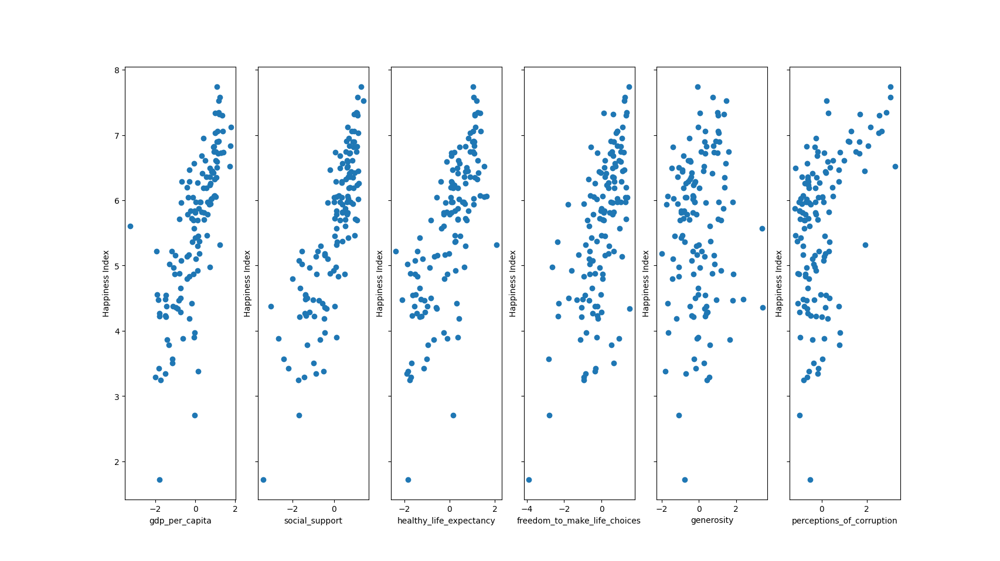
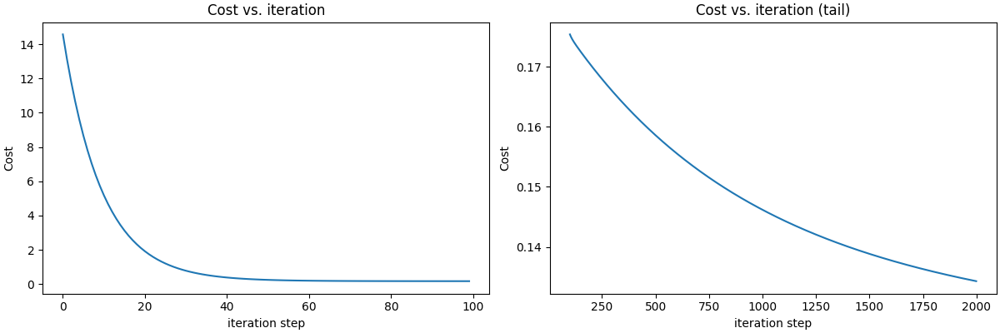

# 😊 Multiple Linear Regression: World Happiness Index Prediction

> Predicting the World Happiness Index using multiple socioeconomic factors with gradient descent optimization


---

## 📌 Overview

This project implements **multiple linear regression from scratch** to predict the World Happiness Index based on six socioeconomic features. The model uses **gradient descent optimization** to find the optimal parameters (weights and bias) that minimize the cost function, enabling insights into what factors contribute most to national happiness.

### 🎯 Key Objectives

✅ **Six Feature Analysis**: Analyze multiple socioeconomic indicators  
✅ **Gradient Descent Optimization**: Iterative parameter optimization  
✅ **Cost Function Minimization**: Monitor convergence and model performance  
✅ **Vectorized Operations**: Efficient computation using NumPy  
✅ **Data Visualization**: Scatter plots and cost progression analysis  

---

## 🤔 Problem Statement

**Goal**: Predict the World Happiness Index based on multiple socioeconomic factors

### Features (Input Variables)
- **GDP per Capita (X₁)**: Economic productivity and wealth
- **Social Support (X₂)**: Strength of family and social networks
- **Healthy Life Expectancy (X₃)**: Years of healthy living expected
- **Freedom to Make Life Choices (X₄)**: Personal autonomy and freedom
- **Generosity (X₅)**: Charitable giving and helping others
- **Perceptions of Corruption (X₆)**: Trust in government and institutions

### Target Variable
- **Happiness Score (y)**: World Happiness Index (0-10 scale)

### The Mathematical Model
```
Happiness = w₁(GDP) + w₂(Social) + w₃(LifeExp) + w₄(Freedom) + w₅(Generosity) + w₆(Corruption) + b
```

Where:
- **w** = weights/coefficients for each feature (learned via gradient descent)
- **b** = bias/intercept term

---

## 📂 Project Structure

```
Multiple Linear Regression/
├── happiness_index_gradient_descent_model.py    # Main training and prediction script
├── model_parameters.py                          # Model functions and utilities
├── WHR_2024.csv                                 # World Happiness Report 2024 dataset
├── README.md                                    # This file
└── images/
    ├── Features_Plots.png                       # Scatter plots of features vs happiness
    └── Cost_vs_Iterations.png                   # Gradient descent convergence plot
```

---

## 📄 Files Description

### `happiness_index_gradient_descent_model.py`
The main execution script that:
- Loads and preprocesses WHR_2024.csv dataset
- Removes rows with missing values
- Visualizes relationships between features and happiness index
- Initializes model parameters and learning rate
- Computes initial gradients
- Runs gradient descent optimization for 1000 iterations
- Visualizes cost function convergence
- Makes predictions on sample data

**Key Variables**:
- `X_train`: Feature matrix (~160 countries × 6 features after removing NaN)
- `y_train`: Target happiness scores
- `alpha`: Learning rate = 0.01 (step size for gradient descent)
- `iterations`: Number of optimization steps = 2000
- `w_final`: Learned weight coefficients
- `b_final`: Learned bias term

### `model_parameters.py`
Contains all model functions:

| Function | Purpose |
|----------|---------|
| `compute_gradient()` | Computes gradients of cost function for backpropagation |
| `compute_cost()` | Calculates Mean Squared Error (MSE) loss |
| `gradient_descent()` | Main optimization algorithm that iteratively updates parameters |

---

## 📊 Visualizations

### Features Distribution

*Scatter plots showing relationship between each socioeconomic factor and the World Happiness Index*

### Model Convergence

*Gradient descent cost function over 2000 iterations, demonstrating model convergence*

---

## 🚀 Getting Started

### Prerequisites
```
Python 3.8+
Pandas
NumPy
Matplotlib
```

### Installation
```bash
pip install pandas numpy matplotlib
```

### Running the Model
```bash
python happiness_index_gradient_descent_model.py
```

### Expected Output
- 6 scatter plots showing each feature vs happiness index
- Final trained weights and bias after 2000 iterations
- Cost function visualization (initial 100 iterations + tail view from iteration 100 onwards)
- Predicted happiness score for the 20th country (X_train[19])

---

## 📊 Training Data

**Dataset**: World Happiness Report 2024 (WHR_2024.csv)
- **Sample Size**: 169 countries (after removing missing values)
- **Features**: 6 socioeconomic indicators
- **Target**: Happiness Score (range: 1.721 - 7.741)

**Sample Data**:
```
Country: Finland
GDP per Capita: 1.844
Social Support: 1.572
Healthy Life Expectancy: 0.695
Freedom to Make Life Choices: 0.859
Generosity: 0.142
Perceptions of Corruption: 0.546
Happiness Score: 7.741 ✓
```

---

## 🔬 Algorithm Details

### 1. **Prediction**
```
ŷ = w·x + b = Σ(wᵢ × xᵢ) + b
```
Uses dot product for efficient computation.

### 2. **Cost Function (MSE)**
```
J(w,b) = (1/2m) × Σ(ŷ - y)²
```
Where m = number of training examples

### 3. **Gradients**
```
∂J/∂w = (1/m) × Σ(ŷ - y) × x
∂J/∂b = (1/m) × Σ(ŷ - y)
```

### 4. **Gradient Descent Update**
```
w := w - α × ∂J/∂w
b := b - α × ∂J/∂b
```
Where α = learning rate

---

## 📈 Hyperparameters

Current configuration in the script:

| Parameter | Value | Description |
|-----------|-------|-------------|
| `alpha` (Learning Rate) | 0.01 | Controls step size in gradient descent |
| `iterations` | 2000 | Number of optimization steps |
| `initial_w` | [0, 0, 0, 0, 0, 0] | Initial weights (6 features) |
| `initial_b` | 0 | Initial bias |

**Note**: Learning rate of 0.01 provides good convergence speed for this dataset.

---

## 📊 Visualization

The script generates a cost convergence plot with two subplots:
1. **Initial Phase**: Cost vs iteration (first 100 iterations)
2. **Tail View**: Cost vs iteration (iterations 100-2000) for detailed convergence analysis

This helps identify:
- Whether the algorithm is converging
- Optimal number of iterations
- Learning rate appropriateness

---

## 💡 Key Concepts

### Vectorization
Using NumPy's `np.dot()` instead of explicit loops provides:
- ✅ Significant speed improvements
- ✅ Cleaner, more readable code
- ✅ Better numerical stability

### Gradient Descent
An iterative optimization algorithm that:
1. Computes gradients (direction of steepest descent)
2. Updates parameters by moving in opposite direction
3. Repeats until convergence

### Cost Function Monitoring
Tracking cost across iterations helps:
- Detect convergence
- Identify learning rate issues
- Validate model training

---

## 🔧 Customization

To use your own data or adjust parameters:

```python
# Step 1: Update training data
X_train = np.array([[...], [...], ...])  # Your features
y_train = np.array([...])                # Your targets

# Step 2: Adjust hyperparameters
alpha = 1.0e-6          # Try different learning rates
no_of_iterations = 2000  # Increase for more training

# Step 3: Initialize parameters
initial_w = np.zeros(num_features)
initial_b = 0.0
```

---

## 📚 Learning Outcomes

This project teaches:
- ✅ Multivariate linear regression fundamentals
- ✅ Gradient descent optimization technique
- ✅ Cost function computation and interpretation
- ✅ Vectorized NumPy operations
- ✅ Model training and convergence analysis
- ✅ Parameter optimization strategies

---

## 🎓 Advanced Extensions

Consider implementing:
- Feature scaling/normalization for faster convergence
- Regularization (L1/L2) to prevent overfitting
- Cross-validation for model evaluation
- Testing set prediction
- Scikit-learn comparison
- Mini-batch gradient descent
- Polynomial features

---

## 📝 Notes

- Initial parameters start at zeros
- Learning rate (alpha = 0.01) balances convergence speed and stability
- MSE is used as the cost metric
- All computations use double-precision floating point
- Script uses `np.dot()` for efficient vectorized predictions
- `os.chdir()` ensures the script finds CSV file regardless of execution directory

---

## 🎯 Next Steps

1. Experiment with different learning rates
2. Try different initial parameters
3. Add more training examples
4. Implement feature normalization
5. Create test set predictions
6. Compare with scikit-learn implementation

---

**Language**: Python 3.7+  
**Libraries**: NumPy, Matplotlib  
**Last Updated**: 2025
